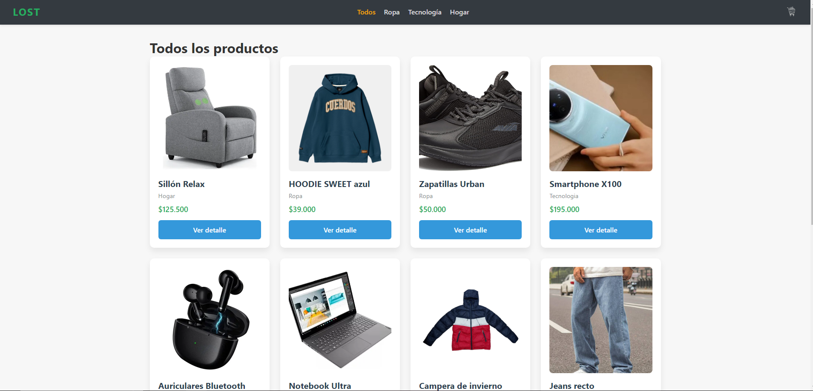
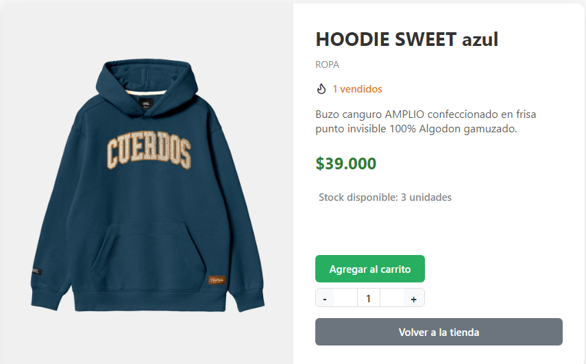
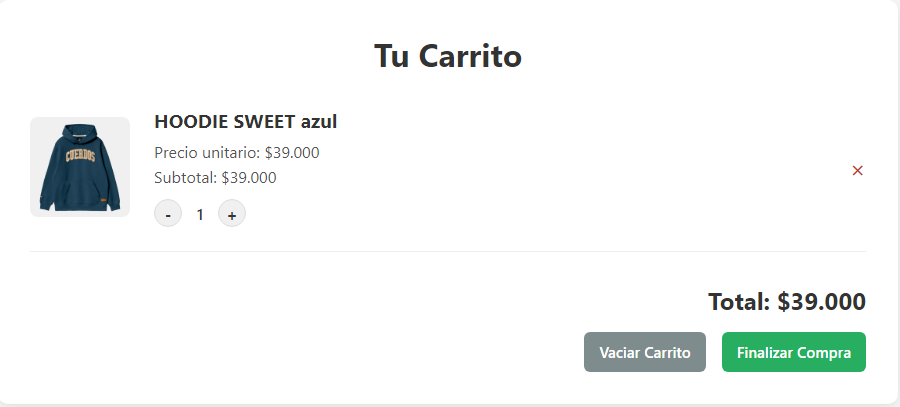
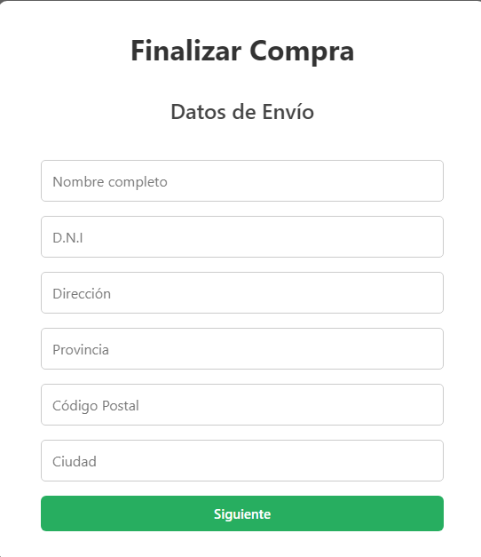
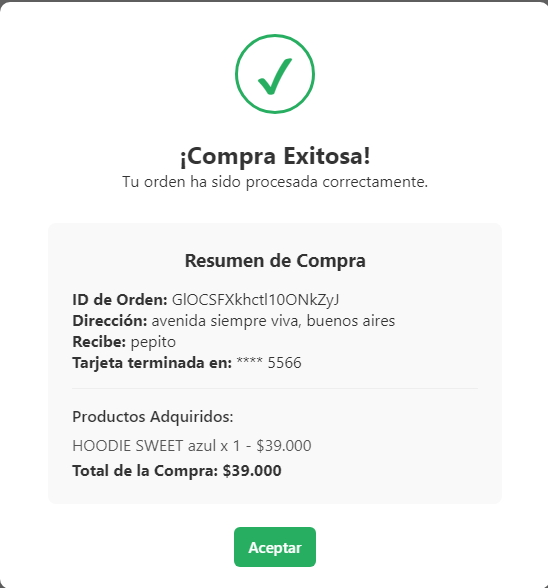

# 🛍️ Tienda LOST - Proyecto Final React

Este proyecto es el e-commerce "LOST", desarrollado como proyecto final para el curso de React en Coderhouse. Es una Single Page Application (SPA) que permite a los usuarios navegar por un catálogo de productos, agregarlos a un carrito y generar una orden de compra. Toda la información de productos y órdenes se persiste en **Firebase Firestore**, y el carrito de compras se guarda en **Local Storage** para no perderse al recargar la página.

---

## 📸 Vistas de la Aplicación

### 1. Catálogo de Productos
*Vista principal de la tienda, donde se muestran todos los productos cargados desde Firestore.*


---

### 2. Vista de Detalle
*Página individual para cada producto con su descripción, stock, contador de vendidos y la opción para agregarlo al carrito.*


---

### 3. Carrito de Compras
*Resumen de los productos agregados, con opciones para modificar cantidades, eliminar ítems o vaciar el carrito.*


---

### 4. Checkout (Formulario Multi-paso)
*Formulario para ingresar los datos de envío y pago antes de confirmar la compra.*


---

### 5. Confirmación de Compra
*Pantalla final que muestra un resumen de la orden, los productos adquiridos y el ID único de la compra generada.*


---

## 📌 Funcionalidades Implementadas

-   **Catálogo de Productos Dinámico:** Visualización de productos cargados directamente desde una base de datos en Firestore.
-   **Filtrado por Categorías:** Navegación y filtrado de productos por las categorías `ropa`, `tecnología` y `hogar`.
-   **Vista de Detalle:** Cada producto cuenta con una página de detalle individual que muestra el stock disponible y la cantidad de unidades vendidas.
-   **Carrito de Compras Persistente y Robusto:**
    -   Añadir productos al carrito con control de stock en tiempo real, evitando sobreventas.
    -   El estado del carrito se guarda en Local Storage, persistiendo entre sesiones.
    -   Funcionalidad para ver, modificar cantidades (aumentar/disminuir), eliminar productos individualmente y vaciar el carrito por completo.
    -   El estado global del carrito es manejado eficientemente con **React Context**.
-   **Proceso de Checkout Completo y Seguro:**
    -   Formulario multi-paso para que el usuario ingrese sus datos de envío y pago.
    -   Generación de una orden de compra que se almacena en una colección de Firestore.
    -   Actualización automática y atómica del stock y del contador de vendidos de los productos comprados, evitando condiciones de carrera.
-   **Experiencia de Usuario Mejorada:**
    -   Diseño completamente adaptable (responsive) para celulares, tablets y computadoras.
    -   Uso de loaders durante las cargas asincrónicas de datos.
    -   Mensajes claros para el usuario (ej: "Carrito vacío", "Producto no encontrado", "Procesando orden...").
    -   Al finalizar la compra, se muestra un resumen detallado con el ID de la orden y los productos adquiridos.

---

## ✅ Objetivos Cumplidos

-   **Desarrollo Front-end con React:** Se desarrolló una SPA completa utilizando componentes, hooks y el Virtual DOM.
-   **Incorporación de Firestore:** La aplicación está 100% conectada a Firestore para la gestión de productos y órdenes.
-   **Listado y Detalle de Productos:** Se generan dinámicamente desde la base de datos.
-   **Separación de Componentes:** Se respeta la arquitectura de componentes contenedores y de presentación.
-   **Componente `ItemCount`:** Implementado con validaciones de stock.
-   **Navegación SPA:** Se utiliza React Router para una navegación fluida y sin recargas.
-   **Gestión de Estado con Context:** El carrito de compras es manejado de forma global.
-   **`Cart` y `CartWidget`:** Ambos componentes son funcionales y reflejan el estado del carrito en tiempo real.
-   **Generación de Órdenes:** Las compras se registran correctamente en Firestore.
-   **Experiencia de Usuario:** Se implementaron todos los mensajes condicionales y de finalización solicitados.

---

## 🧠 Tecnologías Utilizadas

-   **React** (con Hooks: `useState`, `useEffect`, `useContext`, `useParams`).
-   **React Router DOM** para la navegación y enrutamiento.
-   **Firebase Firestore** como base de datos en la nube, con operaciones atómicas (`increment`).
-   **Local Storage** para persistencia del carrito.
-   CSS puro para el estilizado, unificado en un solo archivo y con Media Queries para un diseño responsive.
-   JavaScript (ES6+).

---

## 🚀 Cómo Correr el Proyecto

1.  Clonar el repositorio:
    ```bash
    git clone https://github.com/cxmateo/ReactProyectoFinal.git
    ```

2.  Instalar las dependencias:
    ```bash
    npm install
    ```

3.  Iniciar el servidor de desarrollo:
    ```bash
    npm start
    ```

1.  Acceder a la app desde:
    ```bash
    http://localhost:3000
    ```    
---

## 💡 Autor

**Mateo Leonel Castillo**
Curso ReactJS - Coderhouse
GitHub: [@cxmateo](https://github.com/cxmateo)
